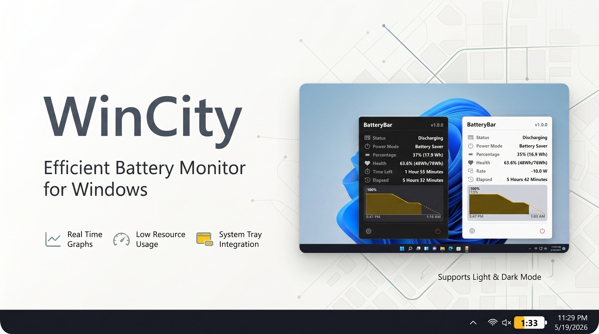

# WinCity

<p align="center">
  
</p>

| Dark Mode | Light Mode |
|------------|------------|
|  |  |


## Features

- **Left-click** the widget to toggle between time and percentage display.
- **Hover** to open a popup: status, health, rate, cycle count, temperature, and a scrolling history graph.
- **Right-click → Quit** to exit.
- Auto-hides when a fullscreen window is active or the taskbar is hidden.

| State | Example |
|---|---|
| Discharging (normal) |  |
| Discharging (low) |  |
| Battery saver |  |
| Charging |  |

---

## Project structure

```
battery_tray/
├── main.py            ← entry point
├── app/
│   ├── config.py      constants, colors/rows globals, load/save config & state
│   ├── system.py      Win32 helpers (DPI, taskbar, dark mode, power mode)
│   ├── battery.py     IOCTL queries, WMI temp fallback, display formatters
│   ├── render.py      battery icon renderer
│   ├── popup.py       hover popup with history graph
│   └── widget.py      main tkinter widget
├── data/
│   ├── config.json    user-editable settings & colors
│   └── state.json     runtime state (history, elapsed time) - gitignored
├── build.ps1          builds dist\WinCity.exe via PyInstaller
├── build.bat          double-click shortcut → runs build.ps1
├── README.md          this file
└── requirements.txt   Python dependencies
```

---

## Quick start

Pre-requisite: Go to Settings (Win + I) > System > Power & Battery > Turn on Battery Percentage.

### Download and run the released .exe:

Download the latest release from the [Releases](https://github.com/AhmarZaidi/wincity/releases/tag/v1.0.0) page, and run `WinCity.exe`.

OR

### Clone the repo and run from source:

```powershell
git clone https://github.com/AhmarZaidi/wincity
pip install -r requirements.txt
python main.py
```

**Run detached in the background:**
```powershell
Start-Process python -ArgumentList "main.py" -WindowStyle Hidden
```

**Stop**
```powershell
Stop-Process -Name python
```

---

## Configuration

Edit `data/config.json` to customise the widget. Changes are picked up automatically without restarting.

Key settings:
- `rows`: control which info rows appear in the popup and in what order (`"visible": false` to hide)
- `colors`: per-theme hex colors for dark, light, graph, and widget fill
- `LOW_PCT`: percentage threshold for the red low-battery indicator
- `OFFSET_FROM_RIGHT`: widget position from the right edge of the taskbar

---

## Build a standalone .exe

**Option A - double-click** `build.bat` in Windows Explorer.

**Option B - from PowerShell:**
```powershell
.\build.ps1
```

Produces `dist\WinCity.exe` - no Python required to run.

---

## Auto-start on login

> The `data/` folder (config, state) is always created next to wherever `WinCity.exe` lives — keep the exe in a permanent location before setting up auto-start.

**Steps (silent start — no console window flashes at login):**

1. Place `WinCity.exe` somewhere permanent, e.g. `C:\Users\<YourName>\Apps\WinCity\WinCity.exe`.
2. Press **Win + R**, type `shell:startup`, press **Enter** — this opens your Startup folder.
3. Right-click inside the Startup folder → **New → Shortcut**.
4. In the *location* field, paste the following (replace the path with your actual exe path):
   ```
   powershell.exe -WindowStyle Hidden -Command "Start-Process 'C:\Users\<YourName>\Apps\WinCity\WinCity.exe'"
   ```
   > Update the path to match where you placed `WinCity.exe`.
5. Click **Next**, name the shortcut (e.g. `WinCity`), click **Finish**.

WinCity will now start silently in the background every time you log in, with no console window.

---

## Troubleshooting

If facing issues like incorrect values at start, or getting stuck, then delete the `data/config.json` file.
A new file will automatically be created next time it starts.

If issue is still not solved, please raise an issue [here](https://github.com/AhmarZaidi/wincity/issues)

## Known Issues

- Graph may be buggy in some edge cases. Especially when charging.
- Charging time estimation may not be accurate.
- Settings button is not implemented yet.

## Todos

- [ ] Add settings page to configure colors, rows, thresholds, etc.
- [ ] Add more battery info like cycle count, temperature, etc.

## Uninstall

Quit via right-click → Quit, then delete the folder and remove the startup shortcut.
