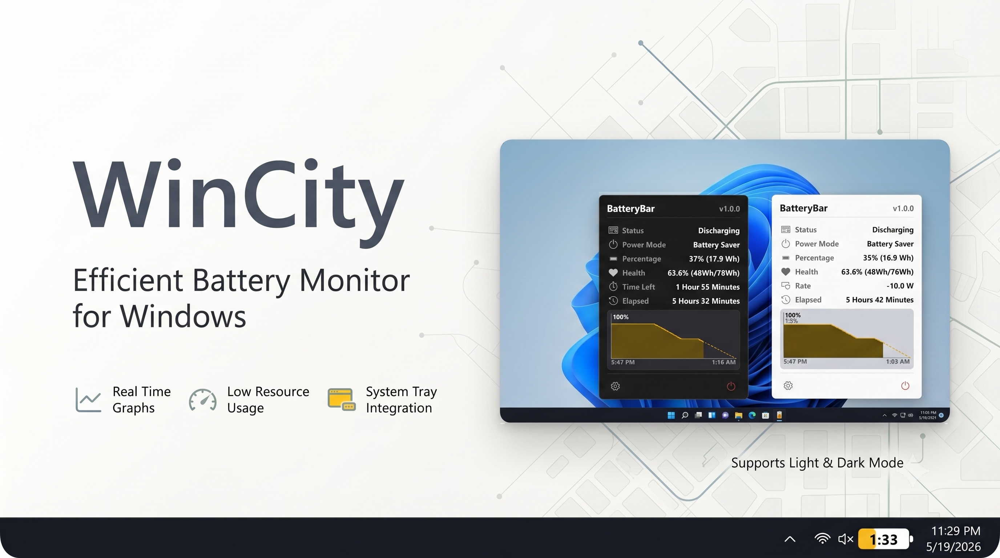

# WinCity

<p align="center">
  
</p>

| Dark Mode | Light Mode |
|------------|------------|
|  |  |

A high-performance, battery-friendly taskbar widget and hardware telemetry monitor for Windows 10/11.

WinCity comes in two fully compatible implementations sharing identical UI themes, state, and JSON configuration:
1. **Rust (Native Win32)**: Ultra-lean (~500 KB standalone executable, 0.00% idle CPU, ~5.5 MB private memory, zero external runtime).
2. **Python (Tkinter)**: Clean and accessible for development, rapid tweaking, and cross-testing.

---

## Performance Comparison (Python vs. Rust)

Measured on Windows 11 with `scripts/benchmark.py`:

| Metric | Python (Tkinter) | Rust (Native Win32) | Improvement / Delta |
|---|---|---|---|
| **Private Working Memory** | `28.94 MB` | `5.54 MB` | **80.9% less memory** |
| **Total Working Set (RSS)** | `84.36 MB` | `25.27 MB` | **68.7% lighter** |
| **Idle CPU Utilization** | `0.00%` | `0.00%` | **Zero CPU drain** |
| **Total Binary Footprint** | ~50+ MB (Python runtime) | `526 KB` | **99% smaller** |
| **Startup / Window Latency** | ~600 ms | `< 15 ms` | **Instant boot** |

---

## Features

- **Battery State Indicator**: Smooth rounded-corner battery icon overlaid on the Windows taskbar with customizable width, height, corner radius, and font size.
- **Left-Click**: Instant toggle between remaining time and percentage display.
- **Hover Popup**: Telemetry dashboard showing:
  - **Status**: Live state (*Fully Charged*, *Charging*, *Discharging*).
  - **Power Mode**: Current Windows power mode (*Best power efficiency*, *Balanced*, *Best performance*).
  - **Percentage & Energy**: Battery percentage with remaining capacity in Wh (*e.g., 25% (12.6 Wh)*).
  - **Battery Health**: True health degradation percentage compared to designed capacity (*e.g., 66.2% (50Wh/76Wh)*).
  - **Time Remaining / Time to Full**: Windows and hardware rate-estimated time to 100% full or 0% depletion.
  - **Charge / Discharge Rate**: Instantaneous power flow in Watts (*+47.1 W* or *-12.4 W*).
  - **Session Elapsed**: Time elapsed since charger was plugged in or unplugged.
  - **Screen On Time**: System uptime session metric.
  - **Est. Runtime**: Estimated battery runtime calculated from full capacity and live power draw.
  - **Hardware Telemetry & Thermals**: Battery cycle count and temperature.
  - **Session History Graph**: Real-time interactive charge/discharge graph with historic session browsing (< and > chevrons) and projected completion time.
- **Per-App Battery Attribution**: Estimates wattage impact per process by inspecting process CPU loads and correlating with instantaneous battery discharge rates, with 1-click process termination.
- **Dynamic Settings & Live Customization**:
  - Popup Font Size stepper with responsive window height calculation.
  - Drag-and-drop icon placement and fine-grained offset adjustments.
  - Interactive row reordering and visibility toggles (Customize Rows page).
  - Configurable polling rate, refresh intervals, and critical battery warnings.
- **Smart Taskbar Integration**: Automatically respects dark/light theme, DPI scaling, and auto-hides during fullscreen apps and games.
- **Zero SmartScreen Warnings**: Double-click ready without certificate warnings via native binary or Windows `.lnk` shortcuts.

| State | Example |
|---|---|
| Discharging (normal) |  |
| Discharging (low) |  |
| Battery saver |  |
| Charging |  |

---

## Project Structure

The repository is cleanly structured with separation between shared data, scripts, and language implementations:

```
wincity/
├── assets/                  # Shared assets (app icon, banners)
│   ├── appicon.ico
│   └── banner.png
├── data/                    # Shared configuration and telemetry history
│   ├── config.json          # Shared settings and color schemes
│   └── state.json           # Runtime history & session state
├── python/                  # Python implementation
│   ├── app/                 # Modules: battery, render, popup, widget, system, startup
│   ├── main.py              # Python entry point
│   ├── wincity.pyw          # Silent windowless GUI launcher
│   └── requirements.txt
├── rust/                    # Native Rust implementation (Win32 API)
│   ├── src/                 # Native modules: battery, render, popup, widget, system, config
│   ├── Cargo.toml
│   └── build.rs             # Resource compilation (embeds appicon.ico)
├── scripts/                 # Shared cross-testing & system tooling
│   ├── benchmark.py         # Resource profiler (RAM, CPU %, handles, threads)
│   └── setup_autostart.py   # Windows shortcut and shell:startup installer
├── run.bat                  # Unified interactive launcher & CLI hub
├── WinCity.lnk              # 1-click double-clickable application shortcut
└── README.md
```

---

## Quick Start

### Option 1: Unified Interactive Hub (`run.bat`)

Double-click **`run.bat`** (or execute in terminal) to launch an interactive menu:
```cmd
run.bat
```
Or pass arguments directly:
- `run.bat rust` — Launches the ultra-low footprint Rust release binary.
- `run.bat python` — Launches the Python Tkinter version.
- `run.bat bench` — Runs the side-by-side benchmark comparison.
- `run.bat setup` — Configures Windows startup & desktop shortcuts.

### Option 2: 1-Click Double-Clickable Shortcut

Run `python scripts/setup_autostart.py --variant rust` (or choose option 4 in `run.bat`).
This will generate **`WinCity.lnk`** directly in the project folder and on your **Desktop**:
- Embedded custom app icon.
- No flashing console window.
- **Zero Windows SmartScreen blockage**.

---

## Auto-Start with Windows

To have WinCity launch silently in the background on Windows login:
- **In-App Menu:** Hover the widget → Click Settings (⚙) → Toggle **"Start with Windows"**.
- **CLI / Script:** Run `python scripts/setup_autostart.py` or use `run.bat setup`.

---

## Profiling & Benchmarking

You can benchmark resource consumption before and after changes:

```powershell
# Profile Rust version for 10 seconds and save results
python scripts/benchmark.py --run rust --duration 10 --save scripts/rust_bench.json

# Profile Python version for 10 seconds and save results
python scripts/benchmark.py --run python --duration 10 --save scripts/python_bench.json

# Compare both side-by-side:
python scripts/benchmark.py --compare scripts/python_bench.json scripts/rust_bench.json
```

---

## Battery & Power Optimizations

1. **Zero Subprocess Spawning**: Eliminated periodic PowerShell and CIM queries. Direct Win32 IOCTL device queries are used instead.
2. **Render Caching**: Frames are only rendered and copied to the taskbar when telemetry or percentage changes (0.00% idle CPU).
3. **Timer Gating**: Telemetry timers and live process polls are suspended whenever the hover popup is closed.
4. **Hardware Caching**: Static battery properties (designed mWh, full charge capacity, serial numbers) are queried once and cached.
5. **Single-Instance Mutex**: Prevents duplicate running instances from consuming unnecessary battery.

---

## Shared Configuration

Edit `data/config.json` (or use the in-app Settings page) to customize:
- `POPUP_TEXT_SIZE`: Popup font size in points (default: `13`).
- `POPUP_REFRESH_INTERVAL`: Refresh interval of the popup in seconds (default: `1.0`).
- `LOW_PCT`: Percentage threshold for the battery saver warning (default: `20`).
- `LOW_CRITICAL_PCT`: Percentage threshold for the red battery warning (default: `10` or `20`).
- `OFFSET_FROM_RIGHT`: Taskbar horizontal position from the system tray (default: `130`).
- `UPDATE_INTERVAL`: Taskbar icon polling interval in seconds when on battery (default: `10`).
- `rows`: Reorder and toggle visibility for all telemetry metrics and the graph.
- `colors`: Customizable dark/light mode palette and graph colors.

---

## License

MIT License. See [LICENSE](LICENSE) for details.
